📊 PDF Word Counter
===================

> A powerful Python tool for text analysis, word frequency counting, and visualization from multiple PDF files.

📖 About
--------

**PDF Word Counter** is a data analysis tool designed to extract insights from unstructured PDF documents. It processes raw text, filters out noise (stopwords, punctuation, numbers) using NLP techniques, and generates actionable data visualizations.

The project features a **Dual Interface** approach:

1.  **Web App (Streamlit):** For interactive analysis, drag-and-drop functionality, and instant reporting.

2.  **CLI (Command Line Interface):** For batch processing, automation, and local script integration.

* * * * *

📸 Screenshots
--------------

<div style="display: flex; gap: 10px;">
   
     
  </div> 
</div>

* * * * *

🧩 System Architecture
----------------------

### Data Pipeline

The application follows a modular pipeline to transform raw PDF binary data into structured insights.

```mermaid
flowchart LR
    A[📂 Input PDFs] -->|PyPDF2| B(📝 Text Extraction)
    B --> C{⚙️ NLP Processor}

    subgraph Processor [Processing Layer]
        C -->|Regex| D[Clean Numbers/Symbols]
        D -->|NLTK| E[Remove Stopwords]
        E -->|Tokenize| F[Word Frequency Counter]
    end

    F -->|Pandas| G[📊 Structured DataFrame]

    G --> H[📈 Scatter Plot]
    G --> I[📥 Excel Report]

```




### Project Structure

The codebase is organized to support both entry points (`app.py` and `main.py`) sharing the same core logic:

-   **`wordcounter/extractor.py`**: Handles file I/O and PDF parsing.

-   **`wordcounter/processor.py`**: Contains the core logic for text cleaning and NLTK integration.

-   **`wordcounter/exporter.py`**: Manages data visualization (Matplotlib) and file export (OpenPyXL).

* * * * *

✨ Features
----------

### 🧠 Natural Language Processing (NLP)

-   **Intelligent Cleaning:** Automatically removes numbers, special characters, and punctuation.

-   **Multi-language Support:** Filters stopwords in multiple languages (default: English & Portuguese).

-   **Customizable Scope:** Users can define strictly which languages to filter via the UI or CLI arguments.

### 📊 Visualization & Reporting

-   **Frequency Analysis:** Calculates the occurrence of every word across all uploaded documents.

-   **Interactive Plots:** Generates scatter plots highlighting the top N most frequent words.

-   **Excel Export:** Downloads the full dataset for further analysis in spreadsheet software.

### 🚀 Dual Mode

-   **Streamlit Web App:** User-friendly interface with sidebar controls for "Top N Words" and language settings.

-   **Terminal CLI:** Robust command-line tool with argument parsing (`argparse`) for custom input/output directories.

* * * * *

🛠 Tech Stack
-------------

-   **Language:** Python 3.10+

-   **Web Framework:** Streamlit

-   **Data Manipulation:** Pandas

-   **NLP:** NLTK (Natural Language Toolkit)

-   **PDF Parsing:** PyPDF2

-   **Visualization:** Matplotlib

-   **Export:** OpenPyXL

* * * * *

⚙️ Installation & Run
---------------------

### Prerequisites

Ensure you have Python installed. It is recommended to use a virtual environment.

Bash

```
# 1. Clone the repository
git clone https://github.com/g-brrzzn/pdf_word_counter.git
cd pdf_word_counter

# 2. Install dependencies
pip install -r requirements.txt

# 3. Download NLTK data (Required for first run)
python -c "import nltk; nltk.download('stopwords'); nltk.download('punkt')"

```

### 🚀 Option 1: Run Web App (Recommended)

The easiest way to use the tool is via the browser interface.

Bash

```
streamlit run app.py

```

*The app will open automatically at `http://localhost:8501`.*

### 🐢 Option 2: Run CLI Tool

For batch processing or terminal usage:

1.  Place your `.pdf` files inside the `inputs/` folder (or specify a custom folder).

2.  Run the script:

Bash

```
# Default run (looks in inputs/ and saves to word_counts.xlsx)
python main.py

# Custom usage
python main.py --input-dir "my_pdfs/" --output-excel "results.xlsx" --top-n 50

```

* * * * *

📝 License
----------

This project is open-source and available under the MIT License.
